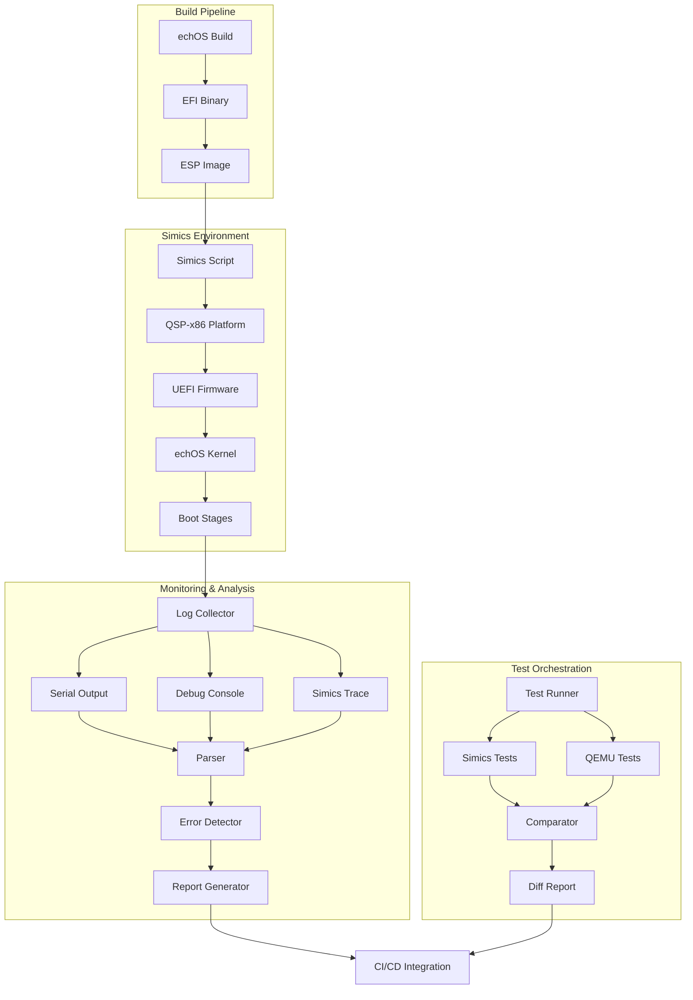

# Tasarım Dokümanı: Intel Simics Boot Entegrasyonu

## Genel Bakış

echOS işletim sistemini Intel Simics simülatörü üzerinde profesyonel şekilde boot etmek, hataları tespit etmek ve analiz etmek için kapsamlı bir entegrasyon sistemi. Mevcut QEMU test altyapısına paralel olarak Simics tabanlı test ve debugging ortamı sağlar. UEFI boot, SMP (multi-core) başlatma, bellek yönetimi ve interrupt handling gibi kritik boot aşamalarını izler ve raporlar.

Sistem, Simics'in gelişmiş debugging özellikleri (reverse execution, checkpoint/restore, deterministik simülasyon) ile echOS'un boot sürecini detaylı şekilde analiz eder. QEMU ile karşılaştırmalı testler yaparak platform bağımsız hataları tespit eder.

## Mimari



## Bileşenler ve Arayüzler

### Bileşen 1: Simics Konfigürasyon Yöneticisi

**Amaç**: Simics simülasyon ortamını yapılandırır ve başlatır

**Arayüz**:
```python
class SimicsConfig:
    def __init__(self, platform: str = "qsp-x86", cpu_count: int = 4):
        """
        Simics konfigürasyonunu başlatır
        
        Args:
            platform: Hedef platform (qsp-x86, qsp-clear-linux)
            cpu_count: Simüle edilecek CPU sayısı
        """
        pass
    
    def set_memory(self, size_mb: int) -> None:
        """Bellek boyutunu ayarlar"""
        pass
    
    def set_firmware(self, firmware_path: str) -> None:
        """UEFI firmware yolunu ayarlar"""
        pass
    
    def add_disk(self, disk_path: str, disk_type: str = "nvme") -> None:
        """Disk image ekler"""
        pass
    
    def enable_logging(self, log_level: str = "info") -> None:
        """Log seviyesini ayarlar"""
        pass
    
    def generate_script(self) -> str:
        """Simics script dosyası oluşturur"""
        pass
```

**Sorumluluklar**:
- Platform seçimi ve yapılandırması
- CPU, bellek, disk parametrelerinin ayarlanması
- UEFI firmware entegrasyonu
- Log ve trace ayarlarının yapılandırılması
- Simics script dosyası oluşturma

### Bileşen 2: Boot İzleme Sistemi

**Amaç**: Boot sürecini aşama aşama izler ve loglar

**Arayüz**:
```python
class BootMonitor:
    def __init__(self, simics_console: SimicsConsole):
        """Boot izleyiciyi başlatır"""
        pass
    
    def register_stage(self, stage_name: str, pattern: str) -> None:
        """Boot aşaması kaydeder"""
        pass
    
    def start_monitoring(self) -> None:
        """İzlemeyi başlatır"""
        pass
    
    def get_current_stage(self) -> Optional[str]:
        """Mevcut boot aşamasını döndürür"""
        pass
    
    def get_stage_duration(self, stage_name: str) -> float:
        """Aşama süresini döndürür (saniye)"""
        pass
    
    def export_timeline(self, output_path: str) -> None:
        """Boot timeline'ını dışa aktarır"""
        pass
```

**Sorumluluklar**:
- Serial output ve debug console izleme
- Boot aşamalarının tespiti (UEFI → Kernel → GDT → IDT → SMP → Scheduler)
- Aşama sürelerinin ölçülmesi
- Timeline oluşturma ve raporlama

### Bileşen 3: Hata Tespit Motoru

**Amaç**: Boot sırasında oluşan hataları tespit eder ve kategorize eder

**Arayüz**:
```python
class ErrorDetector:
    def __init__(self):
        """Hata tespit motorunu başlatır"""
        pass
    
    def add_pattern(self, category: str, pattern: str, severity: str) -> None:
        """Hata pattern'i ekler"""
        pass
    
    def analyze_log(self, log_content: str) -> List[Error]:
        """Log içeriğini analiz eder"""
        pass
    
    def detect_triple_fault(self, simics_state: SimicsState) -> bool:
        """Triple fault tespiti"""
        pass
    
    def detect_page_fault(self, simics_state: SimicsState) -> Optional[PageFault]:
        """Page fault analizi"""
        pass
    
    def detect_smp_failure(self, log_content: str) -> Optional[SmpError]:
        """SMP başlatma hatası tespiti"""
        pass
    
    def generate_report(self, errors: List[Error]) -> str:
        """Hata raporu oluşturur"""
        pass
```

**Sorumluluklar**:
- Pattern-based hata tespiti
- CPU exception analizi (Triple Fault, Page Fault, General Protection Fault)
- SMP başlatma hatalarının tespiti
- Bellek erişim hatalarının analizi
- Hata kategorilendirme ve raporlama

### Bileşen 4: Simics Debugging Arayüzü

**Amaç**: Simics'in gelişmiş debugging özelliklerini kullanır

**Arayüz**:
```python
class SimicsDebugger:
    def __init__(self, simics_connection: SimicsConnection):
        """Debugger'ı başlatır"""
        pass
    
    def create_checkpoint(self, name: str) -> str:
        """Checkpoint oluşturur"""
        pass
    
    def restore_checkpoint(self, checkpoint_id: str) -> None:
        """Checkpoint'i geri yükler"""
        pass
    
    def set_breakpoint(self, address: int, condition: str = None) -> int:
        """Breakpoint ekler"""
        pass
    
    def read_memory(self, address: int, size: int) -> bytes:
        """Bellek okur"""
        pass
    
    def read_register(self, register: str) -> int:
        """Register okur"""
        pass
    
    def reverse_execute(self, steps: int) -> None:
        """Geriye doğru çalıştırır"""
        pass
    
    def trace_execution(self, start_addr: int, end_addr: int) -> List[Instruction]:
        """Execution trace toplar"""
        pass
```

**Sorumluluklar**:
- Checkpoint/restore yönetimi
- Breakpoint yönetimi
- Bellek ve register inceleme
- Reverse execution desteği
- Instruction trace toplama

### Bileşen 5: QEMU Karşılaştırma Motoru

**Amaç**: Simics ve QEMU test sonuçlarını karşılaştırır

**Arayüz**:
```python
class PlatformComparator:
    def __init__(self):
        """Karşılaştırıcıyı başlatır"""
        pass
    
    def run_parallel_tests(self, test_suite: TestSuite) -> ComparisonResult:
        """Paralel testler çalıştırır"""
        pass
    
    def compare_boot_logs(self, simics_log: str, qemu_log: str) -> LogDiff:
        """Boot loglarını karşılaştırır"""
        pass
    
    def compare_memory_layout(self, simics_mem: MemoryMap, qemu_mem: MemoryMap) -> MemoryDiff:
        """Bellek layout'larını karşılaştırır"""
        pass
    
    def identify_platform_specific_issues(self, diff: ComparisonResult) -> List[Issue]:
        """Platform-specific sorunları tespit eder"""
        pass
    
    def generate_diff_report(self, result: ComparisonResult) -> str:
        """Fark raporu oluşturur"""
        pass
```

**Sorumluluklar**:
- Paralel test yürütme
- Log karşılaştırması
- Bellek layout karşılaştırması
- Platform-specific hata tespiti
- Diff raporu oluşturma

### Bileşen 6: Test Otomasyon Sistemi

**Amaç**: Otomatik test senaryolarını yönetir ve çalıştırır

**Arayüz**:
```python
class TestAutomation:
    def __init__(self, config: TestConfig):
        """Test otomasyonunu başlatır"""
        pass
    
    def add_test_scenario(self, scenario: TestScenario) -> None:
        """Test senaryosu ekler"""
        pass
    
    def run_test_suite(self, suite_name: str) -> TestResults:
        """Test suite'i çalıştırır"""
        pass
    
    def run_single_test(self, test_name: str) -> TestResult:
        """Tek test çalıştırır"""
        pass
    
    def generate_test_report(self, results: TestResults) -> str:
        """Test raporu oluşturur"""
        pass
    
    def export_ci_results(self, results: TestResults, format: str = "junit") -> str:
        """CI/CD için sonuçları dışa aktarır"""
        pass
```

**Sorumluluklar**:
- Test senaryosu yönetimi
- Test yürütme ve zamanlama
- Sonuç toplama ve raporlama
- CI/CD entegrasyonu
- Test başarı/başarısızlık analizi

## Veri Modelleri

### Model 1: SimicsBootConfig

```python
@dataclass
class SimicsBootConfig:
    """Simics boot konfigürasyonu"""
    platform: str  # "qsp-x86", "qsp-clear-linux"
    cpu_count: int  # 1-16
    memory_mb: int  # 512-8192
    firmware_path: str  # UEFI firmware yolu
    kernel_path: str  # echOS EFI binary yolu
    esp_path: str  # ESP disk image yolu
    enable_serial: bool = True
    enable_debugcon: bool = True
    enable_trace: bool = False
    log_level: str = "info"  # "debug", "info", "warn", "error"
    checkpoint_interval: int = 0  # 0 = disabled, >0 = saniye
```

**Validasyon Kuralları**:
- `cpu_count` 1-16 arasında olmalı
- `memory_mb` en az 512 olmalı
- `firmware_path`, `kernel_path`, `esp_path` geçerli dosya yolları olmalı
- `log_level` geçerli bir seviye olmalı

### Model 2: BootStage

```python
@dataclass
class BootStage:
    """Boot aşaması bilgisi"""
    name: str  # "UEFI", "Kernel Entry", "GDT Init", "IDT Init", "SMP Init", "Scheduler"
    pattern: str  # Log pattern (regex)
    start_time: float  # Başlangıç zamanı (saniye)
    end_time: Optional[float]  # Bitiş zamanı
    status: str  # "pending", "in_progress", "completed", "failed"
    errors: List[str]  # Bu aşamada tespit edilen hatalar
    
    @property
    def duration(self) -> Optional[float]:
        """Aşama süresi"""
        if self.end_time is not None:
            return self.end_time - self.start_time
        return None
```

**Validasyon Kuralları**:
- `name` boş olmamalı
- `pattern` geçerli regex olmalı
- `start_time` >= 0 olmalı
- `status` geçerli bir durum olmalı

### Model 3: ErrorReport

```python
@dataclass
class ErrorReport:
    """Hata raporu"""
    timestamp: float  # Hata zamanı
    category: str  # "triple_fault", "page_fault", "smp_failure", "memory_error"
    severity: str  # "critical", "error", "warning"
    message: str  # Hata mesajı
    context: Dict[str, Any]  # Ek bağlam bilgisi
    stack_trace: Optional[str]  # Stack trace (varsa)
    registers: Optional[Dict[str, int]]  # CPU register durumu
    memory_dump: Optional[bytes]  # Bellek dump'ı
    
    def to_json(self) -> str:
        """JSON formatında dışa aktarır"""
        pass
    
    def to_markdown(self) -> str:
        """Markdown formatında dışa aktarır"""
        pass
```

**Validasyon Kuralları**:
- `timestamp` >= 0 olmalı
- `category` geçerli bir kategori olmalı
- `severity` geçerli bir seviye olmalı
- `message` boş olmamalı

### Model 4: TestScenario

```python
@dataclass
class TestScenario:
    """Test senaryosu"""
    name: str  # Test adı
    description: str  # Test açıklaması
    config: SimicsBootConfig  # Simics konfigürasyonu
    expected_stages: List[str]  # Beklenen boot aşamaları
    timeout_seconds: int  # Timeout süresi
    success_criteria: List[str]  # Başarı kriterleri (regex patterns)
    failure_patterns: List[str]  # Başarısızlık pattern'leri
    checkpoints: List[str]  # Checkpoint alınacak noktalar
    
    def validate(self) -> bool:
        """Senaryo geçerliliğini kontrol eder"""
        pass
```

**Validasyon Kuralları**:
- `name` boş olmamalı ve benzersiz olmalı
- `timeout_seconds` > 0 olmalı
- `expected_stages` en az 1 aşama içermeli
- `success_criteria` en az 1 kriter içermeli

## Hata İşleme

### Hata Senaryosu 1: Triple Fault

**Durum**: CPU triple fault durumuna girer (genellikle page fault handler'da hata)

**Yanıt**: 
- Simics otomatik olarak durur
- Son checkpoint'e geri dönülür
- CPU register durumu kaydedilir
- Stack trace alınır
- Reverse execution ile hata öncesi adımlar incelenir

**Kurtarma**:
- Checkpoint'ten devam edilir
- Hata raporu oluşturulur
- Debugging bilgileri kaydedilir

### Hata Senaryosu 2: SMP Başlatma Hatası

**Durum**: AP (Application Processor) başlatılamıyor

**Yanıt**:
- AP startup kodunun belleğe doğru kopyalandığı kontrol edilir
- INIT-SIPI-SIPI sequence izlenir
- APIC register durumu incelenir
- AP entry point'te breakpoint konulur

**Kurtarma**:
- Tek CPU ile devam edilir
- SMP hatası raporlanır
- QEMU ile karşılaştırma yapılır

### Hata Senaryosu 3: Bellek Erişim Hatası

**Durum**: Geçersiz bellek erişimi (page fault, segmentation fault)

**Yanıt**:
- Hatalı adres kaydedilir
- Page table durumu incelenir
- Bellek mapping'leri kontrol edilir
- Erişim türü (read/write/execute) belirlenir

**Kurtarma**:
- Checkpoint'e geri dönülür
- Bellek layout raporu oluşturulur
- QEMU ile karşılaştırma yapılır

### Hata Senaryosu 4: Timeout

**Durum**: Boot süreci belirlenen sürede tamamlanmıyor

**Yanıt**:
- Son başarılı aşama belirlenir
- Takıldığı nokta tespit edilir
- CPU durumu incelenir (infinite loop, deadlock)
- Simics trace analiz edilir

**Kurtarma**:
- Simics durdurulur
- Partial boot raporu oluşturulur
- Debugging bilgileri kaydedilir

## Test Stratejisi

### Unit Test Yaklaşımı

Her bileşen için izole unit testler:

- **SimicsConfig**: Konfigürasyon oluşturma ve validasyon testleri
- **BootMonitor**: Stage detection ve timing testleri
- **ErrorDetector**: Pattern matching ve error categorization testleri
- **SimicsDebugger**: Checkpoint ve breakpoint testleri
- **PlatformComparator**: Log diff ve comparison testleri
- **TestAutomation**: Test execution ve reporting testleri

Test coverage hedefi: %80+

### Property-Based Testing Yaklaşımı

**Property Test Kütüphanesi**: Hypothesis (Python)

**Test Edilecek Özellikler**:

1. **Konfigürasyon Geçerliliği**: Rastgele konfigürasyonlar oluştur, validasyon her zaman tutarlı sonuç vermeli
2. **Log Parsing İdempotency**: Aynı log'u birden fazla parse etmek aynı sonucu vermeli
3. **Error Detection Consistency**: Aynı hata pattern'i her zaman aynı kategoriyle eşleşmeli
4. **Checkpoint Restore**: Checkpoint al → restore et → durum aynı olmalı
5. **Timeline Monotonicity**: Boot stage zamanları monoton artan olmalı

### Entegrasyon Test Yaklaşımı

End-to-end test senaryoları:

1. **Başarılı Boot Testi**: echOS'u Simics'te baştan sona boot et
2. **SMP Boot Testi**: 4 CPU ile multi-core boot testi
3. **Bellek Stress Testi**: Farklı bellek boyutlarıyla boot testi
4. **Hata Enjeksiyonu**: Kasıtlı hatalar enjekte et, tespit edilmeli
5. **QEMU Karşılaştırma**: Aynı test Simics ve QEMU'da çalışmalı
6. **Checkpoint/Restore**: Boot ortasında checkpoint al, restore et, devam et

## Performans Değerlendirmeleri

### Boot Süresi Metrikleri

- **Hedef Boot Süresi**: < 5 saniye (Simics'te)
- **UEFI Aşaması**: < 1 saniye
- **Kernel Init**: < 1 saniye
- **SMP Başlatma**: < 2 saniye (4 CPU için)
- **Scheduler Init**: < 0.5 saniye

### Simics Performans Optimizasyonları

- **JIT Compilation**: Simics JIT derleyicisini etkinleştir
- **Checkpoint Stratejisi**: Kritik noktalarda checkpoint al (UEFI sonrası, SMP öncesi)
- **Trace Filtering**: Sadece gerekli trace'leri topla
- **Parallel Testing**: Birden fazla Simics instance paralel çalıştır

### Kaynak Kullanımı

- **Bellek**: Simics instance başına ~2GB
- **CPU**: Instance başına 1-2 core
- **Disk**: Checkpoint'ler için ~500MB/test
- **Network**: CI/CD için artifact upload bandwidth

## Güvenlik Değerlendirmeleri

### Secure Boot Testi

- UEFI Secure Boot etkin durumda boot testi
- İmzasız binary'lerin reddedilmesi testi
- TPM measurement log doğrulaması

### Bellek İzolasyonu

- Kernel/user space ayrımının korunması
- Page table izolasyonu testi
- SMEP/SMAP korumaları testi

### Interrupt Güvenliği

- IDT koruması testi
- Interrupt handler stack overflow testi
- Nested interrupt handling testi

## Bağımlılıklar

### Yazılım Bağımlılıkları

- **Intel Simics**: 6.0+ (QSP-x86 paketi gerekli)
- **Python**: 3.8+ (Simics API için)
- **QEMU**: 7.0+ (karşılaştırma testleri için)
- **Rust**: 1.70+ (echOS build için)
- **OVMF**: UEFI firmware

### Python Paketleri

```
simics>=6.0.0
pytest>=7.0.0
hypothesis>=6.0.0
pyyaml>=6.0
jinja2>=3.0.0
click>=8.0.0
rich>=12.0.0
```

### Simics Paketleri

- `qsp-x86`: x86-64 platform simülasyonu
- `qsp-cpu`: CPU modelleri
- `uefi`: UEFI firmware desteği

### Harici Araçlar

- `grub-mkrescue`: ISO oluşturma (multiboot için)
- `objdump`: Binary analiz
- `gdb`: Debugging (Simics GDB stub ile)

## Doğruluk Özellikleri

Sistem aşağıdaki özellikleri garanti etmelidir:

1. **∀ config ∈ ValidConfigs: validate(config) = true ⟹ boot_succeeds(config) ∨ error_detected(config)**
   - Geçerli her konfigürasyon ya başarılı boot eder ya da hata tespit edilir

2. **∀ stage ∈ BootStages: stage.start_time < stage.end_time**
   - Her boot aşamasının başlangıç zamanı bitiş zamanından küçüktür

3. **∀ error ∈ DetectedErrors: ∃ pattern ∈ ErrorPatterns: matches(error, pattern)**
   - Tespit edilen her hata en az bir pattern ile eşleşir

4. **∀ checkpoint ∈ Checkpoints: restore(checkpoint) ⟹ state_equals(checkpoint.state)**
   - Checkpoint restore işlemi orijinal durumu geri yükler

5. **∀ test ∈ TestSuite: run_simics(test) ∧ run_qemu(test) ⟹ comparable(simics_result, qemu_result)**
   - Her test hem Simics hem QEMU'da çalışabilir ve sonuçlar karşılaştırılabilir

6. **∀ log ∈ BootLogs: parse(log) = parse(parse(log))**
   - Log parsing idempotent'tir

7. **∀ t1, t2 ∈ Timeline: t1.index < t2.index ⟹ t1.timestamp ≤ t2.timestamp**
   - Timeline monoton artandır

8. **∀ error ∈ CriticalErrors: detected(error) ⟹ simulation_stopped ∧ checkpoint_created**
   - Kritik hatalar simülasyonu durdurur ve checkpoint oluşturur
