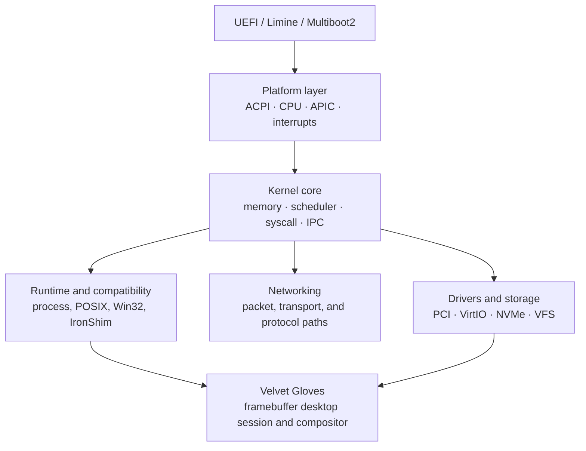

# echOS-x64

**A `no_std` x86-64 operating-system kernel research platform written in Rust.**

echOS is built from the boot boundary upward: firmware handoff, CPU and interrupt
state, memory, scheduling, drivers, storage, networking, and a native graphical
session. The project is aimed at people who want to study and change those layers
in one codebase rather than consume them as opaque services.

[Türkçe README](README.tr.md) · [Technical report](echOS_teknik_rapor.pdf) · [Build and run](#build)

<div align="center">

```text
 ███████╗ ██████╗██╗  ██╗ ██████╗ ███████╗    ██╗  ██╗ ██████╗ ██╗  ██╗
 ██╔════╝██╔════╝██║  ██║██╔═══██╗██╔════╝    ╚██╗██╔╝██╔════╝ ██║  ██║
 █████╗  ██║     ███████║██║   ██║███████╗     ╚███╔╝ ███████╗██║  ██║
 ██╔══╝  ██║     ██╔══██║██║   ██║╚════██║     ██╔██╗ ██╔═══██╗╚════██║
 ███████╗╚██████╗██║  ██║╚██████╔╝███████║    ██╔╝ ██╗╚██████╔╝     ██║
 ╚══════╝ ╚═════╝╚═╝  ╚═╝ ╚═════╝ ╚══════╝    ╚═╝  ╚═╝ ╚═════╝      ╚═╝
```

[](rust-toolchain.toml)
[]()
[]()
[]()
[](LICENSE)

</div>

---

## At a glance

| Item | Current repository shape |
|---|---|
| Language | Rust with `no_std` kernel paths |
| Architecture | x86-64 |
| Boot adapters | UEFI, Limine, Multiboot2 |
| Execution | QEMU/OVMF, Limine BIOS smoke, Multiboot2 smoke, Intel Simics workflows |
| Core areas | CPU, interrupts, memory, scheduler, storage, networking, drivers, security |
| Desktop work | Framebuffer graphics and the Velvet Gloves native session/compositor |
| Status | Active research and engineering development |
| License | AGPL-3.0-only for echOS project code |

echOS is not a Linux distribution and it is not presented as a finished desktop
operating system. Some subsystems are exercised by focused tests and boot gates;
others are active implementation work. The status tables below make that boundary
explicit.

## Why echOS exists

Most operating-system projects expose one interesting layer and borrow the rest.
echOS keeps the layers close enough to inspect together. A change in the boot
context can be followed into the memory manager, scheduler, driver boundary,
filesystem, networking, and graphical session. That makes the repository useful
as a working kernel laboratory as well as a long-term operating-system project.

The design emphasis is straightforward:

- explicit ownership and failure boundaries;
- `no_std`-friendly kernel code with host-side validation where useful;
- lock-free or per-core structures in paths where contention matters;
- real hardware-facing contracts instead of invented register behavior;
- tests and smoke gates that state what has actually been verified.

## Architecture



### Boot paths

The repository contains three boot adapters with a shared kernel phase model:

1. UEFI entry and GOP framebuffer setup;
2. native Limine handoff for the bare-metal path;
3. Multiboot2 handoff for the legacy ISO path.

The adapters converge on common CPU, memory, interrupt, driver, and service
initialization rather than maintaining three unrelated kernels. The repository
contains scripts for building and checking the handoff markers for each path.

### Kernel and platform layer

The platform side covers ACPI discovery, GDT/IDT setup, Local APIC and IO-APIC
handling, interrupt routing, CPU-local state, SMP bring-up, paging, physical frame
allocation, heap allocation, preemption, RCU-style publication, and architecture
specific security controls.

### Storage and filesystem layer

The filesystem work is organized around a unified VFS and explicit backend
contracts. The current tree contains ext4, F2FS, FAT32, exFAT, read-only image
paths, virtual filesystems, and boundary work for NTFS, XFS, and Btrfs. Unsupported
operations are intended to fail explicitly; the project does not treat a returned
success code as proof that durability or recovery semantics exist.

### Networking and drivers

Networking includes packet and transport experiments, while the driver layer
contains PCI, VirtIO, storage, input, display, audio, USB, IOMMU, and related
support paths. Hardware coverage depends on the target and emulator profile. The
presence of a driver module is not, by itself, a claim of production hardware
coverage.

### Velvet Gloves

Velvet Gloves is echOS's native graphical session and compositor work. It is built
around the framebuffer and kernel-owned session path rather than a conventional
desktop stack. The current implementation includes desktop session state, window
and workspace behavior, launcher and application surfaces, input handling, damage
tracking, text/UI rendering, and related shell behavior under `src/gfx/` and
`src/gui/`.

Velvet Gloves is an active subsystem. It is a real part of the repository and a
useful integration target, but it is not advertised as a finished desktop
environment or a drop-in Wayland/X11 implementation.

## Current status

| Area | State | What that means |
|---|---|---|
| Boot adapters | In tree | UEFI, Limine, and Multiboot2 paths share the kernel phase model and have local runners or smoke paths. |
| CPU, interrupts, and memory | Active | Core implementations are present; target-specific and worst-case validation continues. |
| Scheduler and concurrency | Active | CFS/RT/deadline, work-stealing, RCU, and per-CPU work are present in the tree; end-to-end workload evidence is still growing. |
| Filesystem and storage | Test-gated | Phase 6 runners and filesystem corpora cover the declared v1 contracts; full external filesystem parity is not claimed. |
| Networking | Active | Protocol and device paths are implemented in stages; the complete protocol matrix is not closed. |
| GUI and Velvet Gloves | Experimental | The native compositor/session is integrated into the kernel tree and remains under active development. |
| POSIX/Win32/IronShim | Experimental | Compatibility surfaces exist, but they are not a promise of broad application compatibility. |
| Simics validation | Available | The repository contains a hardware-oriented gate workflow that requires a compatible Simics environment. |

The repository's authoritative evidence is the test, smoke, and gate output for a
given revision. This README describes the available paths; it does not turn an
unrun command into a passing result.

## Build

### Prerequisites

- Windows PowerShell;
- internet access and `winget` on the first run if a tool is missing;
- administrator permission when Windows requires it for a package installation;
- Intel Simics only when running the Simics gate.

The normal QEMU runner bootstraps the rest of the local toolchain. It detects Rustup,
the required Rust targets, QEMU, OVMF, Python, and the host linker; missing Windows
packages are installed through `winget`. No pre-generated EFI binary, appliance disk,
or OVMF variable store is required in a clean checkout. Hardware virtualization is
optional: the runner uses WHPX when available and falls back to TCG.

If package installation is not allowed in the current environment, install Rustup,
QEMU/OVMF, and the required host linker manually, then run with `-SkipBootstrap`.
The script reports the exact missing component instead of silently continuing.

On a fresh Rust installation:

```bash
rustup target add x86_64-unknown-none x86_64-unknown-uefi
```

Host-side library check:

```powershell
cargo check --target x86_64-pc-windows-msvc --lib -q
```

UEFI release build:

```powershell
cargo build --target x86_64-unknown-uefi --release
# target/x86_64-unknown-uefi/release/ech_os.efi
```

Bare-metal release build:

```powershell
cargo build --target x86_64-unknown-none --release
# target/x86_64-unknown-none/release/ech_os
```

The bare-metal linker can be selected through `ECHOS_KERNEL_LINKER`; the Limine
runner uses the repository's Limine linker configuration when appropriate.

## Run and validate

### QEMU/OVMF

```powershell
.\run_qemu.ps1
```

This is the intended first-run command. It uses the UEFI path by default, builds the
kernel EFI artifact and the host-side appliance builder, creates the raw GPT appliance
under `build/appliance/`, creates a disposable OVMF variable store, launches the GUI,
and writes the QEMU and serial logs under `logs/`. The same command is safe to repeat;
Cargo and fresh generated artifacts are reused when their inputs are unchanged.

Useful variants:

```powershell
.\run_qemu.ps1 -Headless
.\run_qemu.ps1 -Headless -BootTests
.\run_qemu.ps1 -Profile debug -Accel tcg
.\run_qemu.ps1 -SkipBootstrap
```

`-SkipBootstrap` disables automatic package installation and is intended for machines
whose toolchain is already prepared. `-Mode iso` is an explicit legacy Multiboot2
path; it is not selected automatically just because an old ISO exists in the tree.

### Limine BIOS smoke

```powershell
.\scripts\run_limine_bios_smoke.ps1 -Profile debug
```

### Multiboot2 smoke

```powershell
.\scripts\run_multiboot2_smoke.ps1
```

The legacy `multiboot_iso/` path is kept for the Multiboot2 workflow. The
`multiboot_iso/boot/ech_os` file is a generated kernel image, while the boot
configuration belongs to the boot-media setup.

### UEFI VM appliance

```powershell
.\scripts\build_vm_iso.ps1
# build/appliance/echOS-uefi.iso
```

### Filesystem gate

```powershell
.\scripts\phase6_fs_gate.ps1 -SkipFullTests
```

### Secure Boot and TPM smoke

```powershell
.\scripts\run_secure_boot_qemu_smoke.ps1 -Phase auto -BuildProfile debug -QemuProfile fast
```

This path uses Secure OVMF, a disposable variable store, and WSL `swtpm` on the
documented Windows host workflow. Secure Boot keys and generated enrollment files
are local test material; private keys must never be committed to GitHub.

### Simics gate

```powershell
.\run_simics.ps1
# or
Simics\echos-simics\bin\run-gate.bat
```

The gate reports boot/interrupt/input, syscall/security, filesystem/network,
performance, and IronShim stress axes. A local gate result is tied to the exact
revision and simulator environment that produced it.

## Tests and benchmarks

Host-side tests are configured for the MSVC target because the bare-metal target
does not provide the host test runtime:

```powershell
cargo test --target x86_64-pc-windows-msvc --lib -q
cargo test --target x86_64-pc-windows-msvc --tests -q
```

Nightly benchmarks are defined in `Cargo.toml` and cover memory, scheduling,
filesystem, networking, and address-space paths. Run a benchmark only after
checking its required feature and target contract.

## Repository layout

```text
src/                 kernel, platform, subsystems, GUI, compatibility
helpers/             workspace helper crates
echshell/            user-mode shell component
third_party/         vendored or locally pinned upstream components
scripts/             build, smoke, gate, and verification runners
tests/               host-side and subsystem corpus tests
Simics/              simulator project and gate integration
multiboot_iso/       legacy Multiboot2 boot-media path
docs/                architecture, validation, and engineering records
```

Generated build products do not define the source layout. In particular, do not
commit `target/`, generated ISO trees, Secure Boot private keys, or disposable
VM/TPM state. Keep `artifacts/secure_boot/`, `limine_iso/`,
`limine_iso_extract/`, and `minimal_iso/` local unless a release workflow
explicitly requires a reviewed artifact.

## Working on echOS

Before changing a subsystem, read the nearest architecture or validation document,
check the existing working tree, and keep the patch within a coherent boundary.
For hardware-facing work, record the specification and reference version that
supports the decision. For a behavioral change, update the relevant test or smoke
path with the code.

The most useful contribution is a small, reproducible change with a clear failure
mode and a command that demonstrates the result.

## Third-party code and licensing

The root project is licensed under **AGPL-3.0-only**; see [`LICENSE`](LICENSE).
Third-party components retain their own upstream licenses. Check the manifest and
license files in each `third_party/` or helper crate before redistributing a build.

The repository includes components such as VirtIO support, `smoltcp`, filesystem
helpers, text/rendering support, and local workspace crates. Their presence in the
tree does not change the license of the root project or remove the obligation to
preserve upstream notices.

## License

echOS project code is distributed under the **GNU Affero General Public License
v3.0 only**. Third-party components keep their respective upstream licenses.

---

<div align="center">

*echOS — a kernel project built to keep the interesting parts visible.*

</div>
