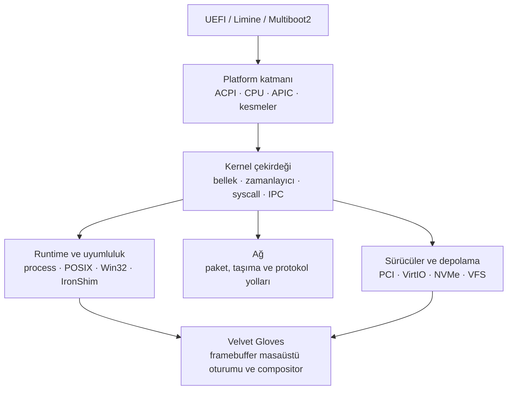

# echOS-x64

**Rust ile yazılmış, `no_std` x86-64 işletim sistemi çekirdeği araştırma ve geliştirme platformu.**

echOS, firmware devrinden başlayıp CPU ve kesme durumuna, belleğe, zamanlayıcıya,
sürücülere, depolamaya, ağa ve yerel grafik oturumuna kadar uzanan tek bir kod
ağacı üzerinde çalışır. Amaç, bu katmanları hazır servisler olarak tüketmek yerine
birlikte inceleyebilmek, değiştirebilmek ve doğrulayabilmektir.

[English README](README.md) · [Teknik rapor](echOS_teknik_rapor.pdf) · [Derleme ve çalıştırma](#derleme)

<div align="center">

```text
 ███████╗ ██████╗██╗  ██╗ ██████╗ ███████╗    ██╗  ██╗ ██████╗ ██╗  ██╗
 ██╔════╝██╔════╝██║  ██║██╔═══██╗██╔════╝    ╚██╗██╔╝██╔════╝ ██║  ██║
 █████╗  ██║     ███████║██║   ██║███████╗     ╚███╔╝ ███████╗██║  ██║
 ██╔══╝  ██║     ██╔══██║██║   ██║╚════██║     ██╔██╗ ██╔═══██╗╚════██║
 ███████╗╚██████╗██║  ██║╚██████╔╝███████║    ██╔╝ ██╗╚██████╔╝     ██║
 ╚══════╝ ╚═════╝╚═╝  ╚═╝ ╚═════╝ ╚══════╝    ╚═╝  ╚═╝ ╚═════╝      ╚═╝
```

[](rust-toolchain.toml)
[]()
[]()
[]()
[](LICENSE)

</div>

---

## Kısaca

| Başlık | Mevcut proje yapısı |
|---|---|
| Dil | Kernel yollarında Rust ve `no_std` |
| Mimari | x86-64 |
| Önyükleme | UEFI, Limine, Multiboot2 |
| Çalıştırma | QEMU/OVMF, Limine BIOS smoke, Multiboot2 smoke, Intel Simics iş akışları |
| Ana alanlar | CPU, kesmeler, bellek, zamanlayıcı, depolama, ağ, sürücüler, güvenlik |
| Grafik | Framebuffer grafikleri ve Velvet Gloves yerel oturumu/compositor'ı |
| Durum | Aktif araştırma ve mühendislik geliştirmesi |
| Lisans | echOS proje kodu için AGPL-3.0-only |

echOS bir Linux dağıtımı değildir ve bitmiş bir masaüstü işletim sistemi olarak
sunulmaz. Bazı alt sistemler test ve boot kapılarıyla doğrulanırken bazıları aktif
geliştirme aşamasındadır. Aşağıdaki durum tabloları bu ayrımı açıkça gösterir.

## echOS neden var?

Birçok işletim sistemi projesi tek bir katmanı öne çıkarıp geri kalanını hazır
olarak alır. echOS ise katmanları birlikte görülebilecek kadar yakın tutar. Boot
bağlamındaki bir değişiklikten bellek yöneticisine, zamanlayıcıya, sürücü sınırına,
dosya sistemine ve grafik oturumuna kadar olan zincir aynı kod ağacında izlenebilir.

Projenin mühendislik yaklaşımı şunlara dayanır:

- sahiplik ve hata sınırlarını açıkça tanımlamak;
- kernel yollarında `no_std`, host tarafında ise gerektiği kadar doğrulama kullanmak;
- çekişmenin önemli olduğu yerlerde lock-free veya per-CPU yapıları tercih etmek;
- uydurma register davranışı yerine gerçek donanım sözleşmelerine dayanmak;
- neyin doğrulandığını test, smoke ve gate çıktılarıyla göstermek.

## Mimari



### Önyükleme yolları

Depoda ortak kernel faz modeline bağlanan üç boot adapter'ı bulunur:

1. UEFI girişi ve GOP framebuffer kurulumu;
2. bare-metal yolu için native Limine handoff;
3. legacy ISO yolu için Multiboot2 handoff.

Adapter'lar üç ayrı kernel yerine ortak CPU, bellek, kesme, sürücü ve servis
başlatma yollarına bağlanır. Her yolun handoff marker'larını ve temel fazlarını
kontrol eden yerel script'ler depoda bulunur.

### Kernel ve platform katmanı

Platform tarafında ACPI keşfi, GDT/IDT kurulumu, Local APIC ve IO-APIC yönetimi,
kesme yönlendirme, CPU-local durum, SMP başlatma, sayfalama, fiziksel frame tahsisi,
heap tahsisi, preemption, RCU tarzı yayınlama ve mimariye özgü güvenlik kontrolleri
yer alır.

### Depolama ve dosya sistemi

Dosya sistemi çalışması unified VFS ve açık backend sözleşmeleri etrafında
kuruludur. Mevcut ağaçta ext4, F2FS, FAT32, exFAT, salt-okunur image yolları,
sanal dosya sistemleri ve NTFS, XFS, Btrfs için sınır çalışmaları bulunur.
Desteklenmeyen işlemlerin açıkça hata vermesi hedeflenir; başarı kodu dönmesi,
tek başına durability veya recovery semantiğinin var olduğu anlamına gelmez.

### Ağ ve sürücüler

Ağ tarafında paket ve taşıma protokolü deneyleri; sürücü tarafında PCI, VirtIO,
depolama, giriş, görüntü, ses, USB, IOMMU ve ilgili destek yolları bulunur.
Donanım kapsamı hedefe ve emulator profiline göre değişir. Bir sürücü modülünün
varlığı, tek başına üretim donanım desteği iddiası değildir.

### Velvet Gloves

Velvet Gloves, echOS'un yerel grafik oturumu ve compositor çalışmasıdır.
Geleneksel bir masaüstü yığını yerine framebuffer ve kernel sahipli oturum yolu
üzerinden ilerler. `src/gfx/` ve `src/gui/` altında masaüstü oturum durumu,
pencere ve workspace davranışı, launcher ve uygulama yüzeyleri, giriş işleme,
damage takibi, metin/UI çizimi ve ilgili shell davranışları bulunur.

Velvet Gloves gerçek ve entegre bir alt sistemdir; ancak bitmiş bir masaüstü ortamı
veya hazır bir Wayland/X11 uygulaması olarak sunulmaz. Geliştirme sürmektedir.

## Mevcut durum

| Alan | Durum | Anlamı |
|---|---|---|
| Boot adapter'ları | Ağaçta mevcut | UEFI, Limine ve Multiboot2 yolları ortak kernel faz modeline bağlanır; yerel runner veya smoke yolu vardır. |
| CPU, kesmeler ve bellek | Aktif | Ana implementasyonlar mevcut; hedefe özgü ve worst-case doğrulama sürüyor. |
| Zamanlayıcı ve concurrency | Aktif | CFS/RT/deadline, work-stealing, RCU ve per-CPU çalışmalar ağaçta; uçtan uca workload kanıtı büyüyor. |
| Dosya sistemi ve depolama | Test kapılı | Phase 6 runner'ları ve corpus'lar ilan edilen v1 sözleşmelerini kapsar; tam dış sistem eşitliği iddia edilmez. |
| Ağ | Aktif | Protokol ve cihaz yolları aşamalı geliştiriliyor; tam protokol matrisi kapanmış değil. |
| GUI ve Velvet Gloves | Deneysel | Yerel compositor/oturum kernel ağacına entegredir ve aktif geliştirme altındadır. |
| POSIX/Win32/IronShim | Deneysel | Uyumluluk yüzeyleri vardır; geniş uygulama uyumluluğu sözü değildir. |
| Simics doğrulaması | Kullanılabilir | Depoda donanım odaklı gate workflow'u vardır; uyumlu Simics ortamı gerekir. |

Bir revizyon için asıl kanıt, o revizyonda üretilmiş test, smoke ve gate çıktısıdır.
README bir komutun mevcut olduğunu anlatır; çalıştırılmamış komutu başarılı ilan etmez.

## Derleme

### Ön koşullar

- Windows PowerShell;
- eksik bir araç varsa ilk çalıştırmada internet bağlantısı ve `winget`;
- Windows bir paket kurulumu için isterse yönetici izni;
- Simics gate'i çalıştırılacaksa uyumlu Intel Simics kurulumu.

Normal QEMU runner'ı yerel araç zincirinin geri kalanını kendisi hazırlar. Rustup'ı,
gerekli Rust hedeflerini, QEMU'yu, OVMF'yi, Python'ı ve host linker'ını kontrol eder;
eksik Windows paketlerini `winget` üzerinden kurar. Temiz bir checkout'ta önceden
üretilmiş EFI dosyası, appliance diski veya OVMF değişken deposu bulunması gerekmez.
Donanım sanallaştırması zorunlu değildir: runner varsa WHPX kullanır, yoksa TCG'ye
düşer.

Ortamda paket kurulumu yasaksa Rustup, QEMU/OVMF ve gerekli host linker'ını elle kurup
`-SkipBootstrap` ile çalıştırın. Script eksik bileşeni açıkça bildirir; sessizce
eksik kurulumla devam etmez.

Yeni bir Rust kurulumu için:

```bash
rustup target add x86_64-unknown-none x86_64-unknown-uefi
```

Host tarafı kütüphane kontrolü:

```powershell
cargo check --target x86_64-pc-windows-msvc --lib -q
```

UEFI release derlemesi:

```powershell
cargo build --target x86_64-unknown-uefi --release
# target/x86_64-unknown-uefi/release/ech_os.efi
```

Bare-metal release derlemesi:

```powershell
cargo build --target x86_64-unknown-none --release
# target/x86_64-unknown-none/release/ech_os
```

Bare-metal linker, `ECHOS_KERNEL_LINKER` üzerinden seçilebilir. Limine runner'ı
uygun olduğunda depodaki Limine linker yapılandırmasını kullanır.

## Çalıştırma ve doğrulama

### QEMU/OVMF

```powershell
.\run_qemu.ps1
```

İlk çalıştırma için önerilen komut budur. Varsayılan olarak UEFI yolunu seçer; kernel
EFI dosyasını ve host tarafındaki appliance builder'ını derler, `build/appliance/`
altında raw GPT appliance üretir, disposable OVMF değişken deposu oluşturur, GUI'yi
açar ve QEMU ile seri loglarını `logs/` altında tutar. Aynı komut, girdiler değişmediyse
Cargo çıktılarını ve güncel üretilmiş artifact'leri yeniden kullanarak tekrar çalışır.

Kullanışlı seçenekler:

```powershell
.\run_qemu.ps1 -Headless
.\run_qemu.ps1 -Headless -BootTests
.\run_qemu.ps1 -Profile debug -Accel tcg
.\run_qemu.ps1 -SkipBootstrap
```

`-SkipBootstrap`, otomatik paket kurulumunu kapatır ve araç zinciri zaten hazırlanmış
makineler içindir. `-Mode iso` açıkça seçilen legacy Multiboot2 yoludur; ağaçta eski
bir ISO bulunduğu için otomatik olarak seçilmez.

### Limine BIOS smoke

```powershell
.\scripts\run_limine_bios_smoke.ps1 -Profile debug
```

### Multiboot2 smoke

```powershell
.\scripts\run_multiboot2_smoke.ps1
```

Legacy `multiboot_iso/` yolu Multiboot2 workflow'u için tutulur.
`multiboot_iso/boot/ech_os` üretilmiş kernel imajıdır; boot yapılandırması ise
boot-media kurulumunun parçasıdır.

### UEFI VM appliance

```powershell
.\scripts\build_vm_iso.ps1
# build/appliance/echOS-uefi.iso
```

### Dosya sistemi kapısı

```powershell
.\scripts\phase6_fs_gate.ps1 -SkipFullTests
```

### Secure Boot ve TPM smoke

```powershell
.\scripts\run_secure_boot_qemu_smoke.ps1 -Phase auto -BuildProfile debug -QemuProfile fast
```

Bu yol, dokümante edilen Windows workflow'unda Secure OVMF, disposable variable
store ve WSL `swtpm` kullanır. Secure Boot anahtarları ve enrollment dosyaları yerel
test malzemesidir; özel anahtarlar GitHub'a hiçbir koşulda yüklenmemelidir.

### Simics kapısı

```powershell
.\run_simics.ps1
# veya
Simics\echos-simics\bin\run-gate.bat
```

Kapı; boot/kesme/giriş, syscall/güvenlik, dosya sistemi/ağ, performans ve IronShim
stres eksenlerini raporlar. Her sonuç, onu üreten revizyon ve simulator ortamıyla
birlikte değerlendirilmelidir.

## Testler ve benchmark'lar

Bare-metal hedefi host test runtime'ı sağlamadığı için host testleri MSVC hedefiyle
çalıştırılır:

```powershell
cargo test --target x86_64-pc-windows-msvc --lib -q
cargo test --target x86_64-pc-windows-msvc --tests -q
```

Nightly benchmark'ları `Cargo.toml` içinde tanımlıdır; bellek, zamanlayıcı, dosya
sistemi, ağ ve address-space yollarını kapsar. Bir benchmark çalıştırmadan önce
gerekli feature ve target sözleşmesini kontrol edin.

## Depo yapısı

```text
src/                 kernel, platform, alt sistemler, GUI, uyumluluk
helpers/             workspace helper crate'leri
echshell/            user-mode shell bileşeni
third_party/         vendored veya yerel olarak sabitlenmiş upstream bileşenler
scripts/             build, smoke, gate ve doğrulama runner'ları
tests/               host ve alt sistem corpus testleri
Simics/              simulator projesi ve gate entegrasyonu
multiboot_iso/       legacy Multiboot2 boot-media yolu
docs/                mimari, doğrulama ve mühendislik kayıtları
```

Üretilmiş build çıktıları kaynak ağacını tanımlamaz. Özellikle `target/`, üretilmiş
ISO ağaçları, Secure Boot özel anahtarları ve disposable VM/TPM durumları commit
edilmemelidir. `artifacts/secure_boot/`, `limine_iso/`, `limine_iso_extract/` ve
`minimal_iso/` yalnızca açıkça incelenmiş bir release artifact'i gerekiyorsa
paylaşılmalıdır.

## echOS üzerinde çalışmak

Bir alt sistemi değiştirmeden önce en yakın mimari veya doğrulama dokümanını okuyun,
çalışma ağacını kontrol edin ve değişikliği tutarlı bir sınır içinde tutun.
Donanım odaklı çalışmalarda kararı destekleyen specification ve referans sürümünü
kaydedin. Davranış değiştiğinde ilgili test veya smoke yolunu da güncelleyin.

En değerli katkı; sınırı belli, hata davranışı açık ve sonucu bir komutla
gösterilebilen küçük ve yeniden üretilebilir bir değişikliktir.

## Üçüncü taraf kod ve lisans

Kök proje **AGPL-3.0-only** lisanslıdır; ayrıntılar için [`LICENSE`](LICENSE)
dosyasına bakın. Üçüncü taraf bileşenler kendi upstream lisanslarını korur.
Yeniden dağıtım öncesinde her `third_party/` veya helper crate içindeki manifest ve
lisans dosyalarını kontrol edin.

Depoda VirtIO desteği, `smoltcp`, dosya sistemi yardımcıları, metin/rendering
destekleri ve yerel workspace crate'leri gibi bileşenler bulunur. Bunların ağaçta
yer alması kök projenin lisansını değiştirmez ve upstream bildirimlerinin korunması
gereğini ortadan kaldırmaz.

## Lisans

echOS proje kodu **GNU Affero General Public License v3.0 only** kapsamında
dağıtılır. Üçüncü taraf bileşenler kendi upstream lisanslarını korur.

---

<div align="center">

*echOS — ilginç kısımları görünür tutan bir kernel projesi.*

</div>
